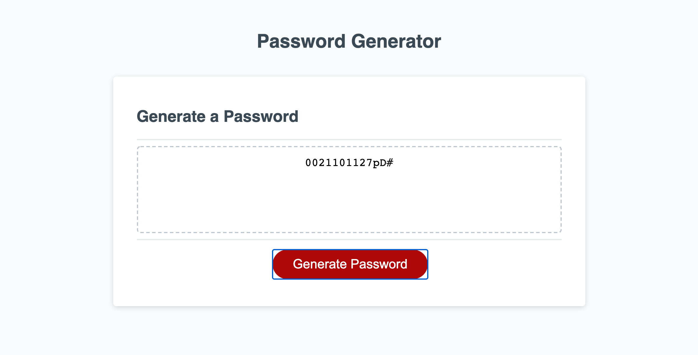

* Duplicate the code from Homework folder
* Drew down the framework for myself to start the logic
* Started coding JS
* By using const to have all the special charaters to call the sc. which don't need to apply var to " " each indiviaul sc.
* GitHub url: https://github.com/kenchenpcpm/KC_WK3HW_Password-Generator
* Gitpage url: https://kenchenpcpm.github.io/KC_WK3HW_Password-Generator/
